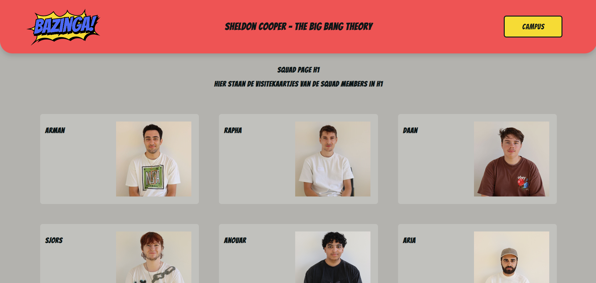
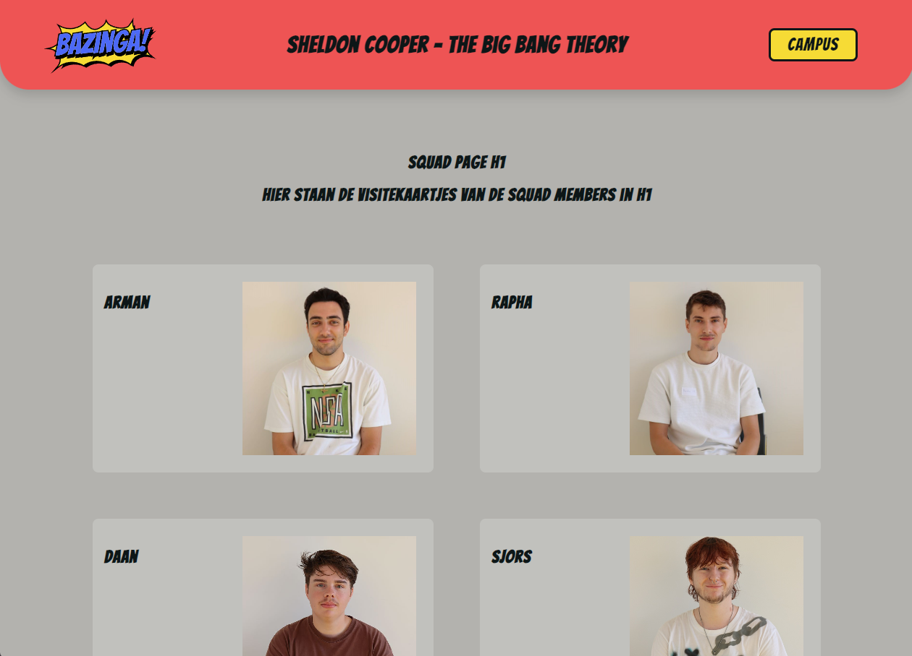
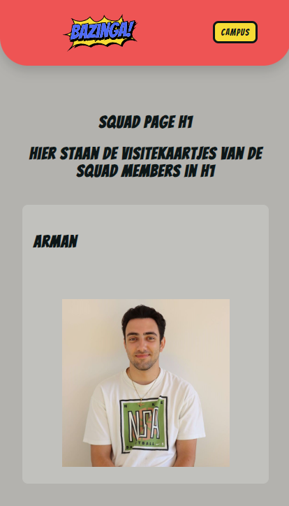
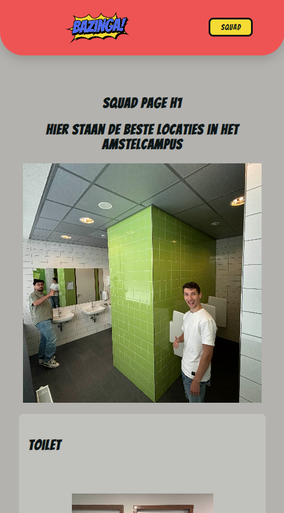

# Squad page

Ontwerp en maak met een team een Squad Page met HTML, CSS en JS.

De instructie van deze leertaak staan in de [INSTRUCTIONS.md](https://github.com/fdnd-task/your-tribe-squad-page/blob/main/docs/INSTRUCTIONS.md)

## Licentie

This project is licensed under the terms of the [MIT license](./LICENSE).

BAZINGA leesmij

Wij hebben een squadpage gemaakt met als thema: Sheldon Cooper (BAZINGA) van de serie The Big Bang Theory! Wij kozen hiervoor onze page lekker luchtig en spannend te houden.

Onze page is verdeeld over 2 verschillende pagina's: de visitekaartjes van de squad en de campuspagina met informatie over de campus. Deze pagina's zijn te bereiken via de gele button in de header.

We hebben een aantal felle kleuren en een speelse font gebruikt om een beetje in de comic style te blijven. De header (die redelijk groot is) verdwijnt automatisch bij het scrollen, zodat hij niet in de weg zit. Als de gebruiker weer helemaal naar boven scrollt, verschijnt deze weer. 

Onze page is responsive en is gebaseerd op mobile first design. Hiervoor hebben we een media query gebruikt. De kaartjes zijn op mobiel één opvolgende lijst en op desktop/widescreen zijn er maximaal 3 kaartjes naast elkaar.

Onze persoonlijke visitekaartjes zijn bereikbaar via een button op onze kaartjes op de squadpage. Hier is meer informatie te vinden over onze teamleden: Arman, Daan, Sjors en Rapha.

Hieronder screenshots van onze page met verschillende voorbeelden van onze responsive design.

